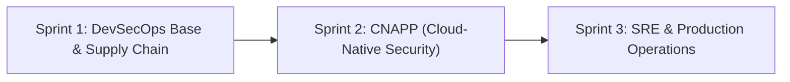

# Engineering Roadmap & Architecture Evolution: Forensic Custody API

## 1. Executive Summary & Architecture Vision
This document serves as the immutable baseline record for the technical evolution of `forensic-custody-api`. The project is structured across three progressive milestones, evolving from a raw microservice into an enterprise-grade, cloud-native, observable, and hardened production workload.

---

## 2. Industry Standards & Assurance Target

| Standard / Framework | Organization | Target Level | Architectural Justification |
|---|---|---|---|
| **SLSA** (Supply-chain Levels for Software Artifacts) | OpenSSF / Google | **Build Level 3** | Isolated CI runner, CycloneDX SBOM generation, keyless OIDC signing and provenance attestation via Cosign and Rekor transparency log. |
| **OWASP ASVS** (Application Security Verification Standard) | OWASP | **Level 2 (Standard / Defense-in-Depth)** | Threat modeling (STRIDE), WORM immutable storage, DAST schema fuzzing, and edge TLS termination. Excludes military-grade Level 3 formal proofs. |
| **CIS Benchmarks** | Center for Internet Security | **Profile Level 1** | Distroless non-root container, SSE-S3 encryption, and least-privilege IAM policies without the operational overhead of multi-region replication. |
| **OWASP SAMM** (Software Assurance Maturity Model) | OWASP | **Level 2 (Structured & Automated)** | Shift-left automation across local pre-commit hooks, deterministic CI gates, and continuous posture auditing. |

---

## 3. Master Backlog: Concept vs. Tool Mapping

### SPRINT 1: DevSecOps Base & Supply Chain Security
*Status: Completed*

* **Minimal Runtime & Static Compilation** | `Go 1.27` — Pure standard library (`net/http`), zero external runtime dependencies.
* **Minimal Distroless Packaging** | `Docker Multi-stage + Distroless Debian 12` — Rootless runtime (`UID 65532`), ~5.6MB attack surface without `/bin/sh`.
* **Remote Secret Scanning** | `Gitleaks CLI` — History and commit scanning in `.github/workflows/security.yml`.
* **SAST (Static Application Security Testing)** | `Semgrep` — Automated static rules for Go vulnerabilities.
* **SCA (Symbol Reachability Analysis)** | `Govulncheck` — Call-graph reachability analysis on compiled Go symbols.
* **Container Security Scanning** | `Trivy` — Image vulnerability scanning in CI.
* **IaC Security** | `Checkov` — Static misconfiguration auditing across Terraform files.
* **Policy as Code** | `Conftest (OPA Rego)` — Custom policy validation for IAM naming, S3 Object Lock, and mandatory tags.
* **SBOM Generation** | `Syft` — CycloneDX JSON artifact generation (`sbom.json`).
* **SBOM Vulnerability Scanning** | `Grype` — Pre-publish quality gate in `.github/workflows/supply-chain.yml`.
* **Cryptographic Signing & Attestation** | `Cosign (Sigstore / Rekor)` — Ephemeral keyless signing with GitHub Actions OIDC identity.
* **WORM Infrastructure & Least Privilege** | `Terraform (AWS S3 + IAM)` — Evidence bucket with Object Lock and strictly scoped IAM policies.

---

### SPRINT 2: CNAPP (Cloud-Native Application Protection Platform)
*Status: In Progress*

#### Phase 1: Local Hardening & Deterministic CI/CD (Completed)
1. **Shift-Left Local Secret Prevention** | `pre-commit` + `Gitleaks` — `.pre-commit-config.yaml` client-side commit interception.
2. **Automated Dependency Updates** | `Dependabot` — `.github/dependabot.yml` weekly tracking of Go modules and GitHub Actions with SemVer analysis.
3. **Schema-Driven API DAST** | `OWASP ZAP API Scan` + `OpenAPI 3.0` — `docs/openapi.yaml` driving active payload fuzzing against all 8 operations.
4. **Deterministic Security Gates** | `Trivy (--ignore-unfixed)` & `Grype (--only-fixed)` — Breaking builds strictly on actionable CVSS $\ge$ 7 vulnerabilities with available patches.
5. **Granular SBOM Component Auditing** | `jq` Parser in CI — Clear separation of OS-level packages (`pkg:deb`) vs Application libraries (`pkg:golang`).

#### Phase 2: Threat Modeling & Security Posture (Completed)
1. **Threat Modeling (Security by Design)** | `STRIDE Framework` — `docs/STRIDE_THREAT_MODEL.md` analysis across all 6 threat categories.
2. **Live Cloud Auditing vs IaC (Drift Detection)** | `Checkov` vs `Prowler` — `docs/IAC_vs_CSPM.md` and live scheduled scanning via `.github/workflows/cspm.yml`.
3. **Centralized Vulnerability Management (ASPM)** | `OWASP DefectDojo` — `docs/ASPM_DEFECTDOJO_ARCHITECTURE.md` unified API ingestion, deduplication, and SLA tracking.

#### Phase 3: Workload Protection, K8s & Zero-Trust (CWPP / CIEM) (In Progress)
1. **Dynamic Secrets & Ephemeral Leases (CIEM)** | `HashiCorp Vault / AWS Secrets Manager` — Just-in-time credentials with short TTLs.
2. **Kubernetes Admission Controllers** | `Kyverno vs OPA Gatekeeper` — Pre-deployment manifest validation (enforcing non-root, distroless, and resource quotas).
3. **Kernel-Level Runtime Security (CWPP)** | `Falco / eBPF` — Kernel syscall interception detecting interactive shells and anomalous executions.
4. **Hardening & Immutable Base Images** | `Packer + CIS Benchmarks / OpenSCAP` — Golden images audited against CIS standards.

---

### SPRINT 3: SRE (Site Reliability Engineering) & Production Operations
*Status: Planned*

#### Phase 1: Observability, Metrics & SLI/SLO
1. **Service Metrics, SLI/SLO & Error Budgets** | `Prometheus` — Instrumentation of `http_requests_total`, latency percentiles, and burn rate alerting.
2. **Distributed Tracing & Structured Logs** | `OpenTelemetry (OTel)` — End-to-end trace correlation linking JSON logs via `trace_id`.
3. **Alert Hygiene & Anomaly Detection** | `Prometheus Alertmanager` — Multi-window alerting preventing on-call fatigue.
4. **Observability as Code** | `Datadog Terraform Provider` — Declarative 5xx monitors, SLOs, and dashboards in `terraform/datadog/`.
5. **Native Cloud Telemetry** | `AWS CloudWatch Metrics` — TargetResponseTime and HTTP 5xx tracking on Application Load Balancers.

#### Phase 2: Software Resilience & Availability Patterns
1. **Traffic Throttling & Abuse Prevention** | `Rate Limiting Middleware (Go)` — Token-bucket rate limiting preventing memory exhaustion.
2. **Cascading Failure Prevention** | `Circuit Breaker & Exponential Backoff` — Graceful degradation during downstream outages.

#### Phase 3: Infrastructure, Networking & Advanced Kubernetes
1. **Secure Remote State & Locking** | `S3 Backend + DynamoDB Lock` — `terraform/backend.tf` state concurrency protection in CI/CD.
2. **Base Network Architecture & Tiered Subnets** | `Terraform AWS VPC Module` — `terraform/vpc.tf` public subnets for ALB and private subnets for workloads/DBs.
3. **Kubernetes Workload Orchestration** | `Kubernetes Manifests` — `Deployment`, `Service`, `Ingress`, and health probes (`livenessProbe`/`readinessProbe`).
4. **Traffic Balancing & Reverse Proxies** | `AWS Application Load Balancer (ALB)` — Edge TLS 1.3 termination (ADR 0001) and HTTP status code troubleshooting (502 vs 504).
5. **Transparent mTLS & Workload Identity** | `Service Mesh (Linkerd / Istio)` — East-west mutual TLS with SPIFFE/SPIRE workload identities.
6. **Low-Level Linux Troubleshooting** | `Linux Diagnostic Kit` — Operational runbook for `htop`, `ss`, `journalctl`, `tcpdump`, `strace`, and `curl -v`.

#### Phase 4: Release Engineering, SRE Culture & AIOps
1. **Secure GitOps & Progressive Delivery** | `ArgoCD + Argo Rollouts` — Pull-based deployment model; automated Canary and Rolling updates.
2. **Incident Management & Blameless Postmortems** | `Blameless Incident Protocol` — Root Cause Analysis (RCA) framework and incident templates in `docs/postmortems/`.
3. **AI Workload Security & Operations (AIOps)** | `OWASP Top 10 for LLMs` — Guardrails against prompt injection, credential leakage in prompts, and blast radius containment.
