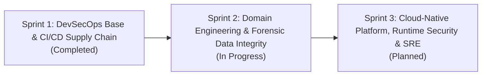

# Forensic Custody API — Architecture Roadmap & Evolution

## 1. Executive Summary & Architecture Vision
This document defines the technical evolution of `forensic-custody-api`. The objective is to build an enterprise-grade digital forensic evidence microservice coupled with a production-ready, cloud-native DevSecOps and SRE platform on AWS.

---

## 2. Industry Standards, Assurance Targets & Verification

| Standard / Framework | Version / Organization | Target Level | Verification Mechanism | Architectural Scope |
|---|---|---|---|---|
| **SLSA** | v1.0 (OpenSSF / Google) | **Build Level 2** *(Targeting L3 upon provenance builder)* | `gh attestation verify` / `slsa-verifier` | Hosted CI runner, isolated build pipeline, signed CycloneDX SBOM, and immutable commit tags. |
| **OWASP ASVS** | v4.0.3 (Level 2) | **Level 2 (Standard Enterprise)** | Automated DAST + SAST + Code Review | Defense-in-depth, strict cryptographic verification, role-based access control, and audit logs. |
| **CIS AWS Foundations** | v3.0 (CIS) | **Profile Level 1** | Prowler Automated Scans (`.github/workflows/cspm.yml`) | Non-root containers, S3 Object Lock compliance mode, KMS CMK encryption, least privilege IAM. |
| **OpenSSF Scorecard** | OpenSSF | **Score $\ge$ 8.0** | Scorecard GitHub Action + Badge | Automated checks on branch protection, signed commits, pinned dependencies, and vulnerability scanning. |

---

## 3. Master Engineering Backlog

### SPRINT 1: DevSecOps Base & CI/CD Supply Chain Security
*Status: Completed*

| Concept | Tool / Technology | Implementation / Evidence |
|---|---|---|
| **Minimal Runtime & Static Compilation** | Go 1.27 (`net/http`) | Pure Go standard library, zero external runtime dependencies (`cmd/api/main.go`). |
| **Distroless Rootless Packaging** | Docker Multi-stage + Distroless Debian 12 | Rootless runtime (`UID 65532`), ~5.6MB attack surface without `/bin/sh` (`Dockerfile`). |
| **Pre-Commit Secret Prevention** | `pre-commit` + `Gitleaks` | Local git hooks preventing secret leakage prior to commit (`.pre-commit-config.yaml`). |
| **Remote Secret Scanning** | `Gitleaks CLI` | Full repository git history scan in CI (`.github/workflows/security.yml:secrets`). |
| **Static Application Security (SAST)** | `Semgrep` | Automated security rule enforcement (`.github/workflows/security.yml:sast`). |
| **Software Composition Analysis (SCA)** | `Govulncheck` | Static call-graph symbol reachability analysis (`.github/workflows/security.yml:govulncheck`). |
| **Container Image Scanning** | `Trivy` (`--ignore-unfixed`) | Deterministic vulnerability gate in CI (`.github/workflows/security.yml:trivy-image`). |
| **IaC Static Analysis** | `Checkov` | Static misconfiguration scanning across Terraform files (`.github/workflows/security.yml:checkov`). |
| **Policy as Code** | `Conftest (OPA Rego)` | Custom Rego rules enforcing IAM naming, tags, and S3 lock (`.github/workflows/security.yml:conftest`). |
| **SBOM Generation & Auditing** | `Syft` + `jq` | CycloneDX SBOM generation and granular OS vs Go library auditing (`.github/workflows/supply-chain.yml`). |
| **SBOM Vulnerability Quality Gate** | `Grype` (`--only-fixed`) | Deterministic vulnerability gate based on fixable CVSS $\ge$ 7 (`.github/workflows/supply-chain.yml`). |
| **Cryptographic Image Signing** | `Cosign` (Sigstore / Rekor) | Keyless OIDC signing published to Rekor transparency log (`.github/workflows/supply-chain.yml`). |
| **Automated Dependency Updates** | `Dependabot` | Weekly automated dependency scanning for Go modules and GitHub Actions (`.github/dependabot.yml`). |
| **Dynamic API Security Testing (DAST)** | `OWASP ZAP API Scan` + OpenAPI 3.0 | Schema-driven active fuzzing against all operations (`docs/openapi.yaml`, `.github/workflows/security.yml:dast`). |
| **Continuous Security Posture (CSPM)** | `Prowler` | Automated live AWS auditing against IAM and S3 (`.github/workflows/cspm.yml`). |

---

### SPRINT 2: Domain Engineering & Forensic Data Integrity
*Status: In Progress*

#### Phase 1: Threat Modeling & Infrastructure Baseline (First Step)
1. **Threat Modeling (Security by Design)** | `STRIDE Framework` — Formal analysis of forensic data spoofing, tampering, repudiation, info disclosure, DoS, and elevation of privilege (`docs/STRIDE_THREAT_MODEL.md`).
2. **IaC Remote State Locking** | `Terraform S3 Backend + DynamoDB Lock` — Prevent concurrent pipeline state corruption and ensure encrypted state storage (`terraform/backend.tf`).
3. **AWS Workload Identity Federation (CIEM / Zero-Trust)** | `AWS IAM OIDC + GitHub Actions` — Elimination of static long-lived IAM keys; ephemeral STS tokens scoped to repository branch.
4. **Vulnerability Prioritization & Ingestion (ASPM)** | `OWASP DefectDojo + EPSS/CISA KEV Prioritization` — Centralized triage combining CVSS, Exploit Prediction Scoring System (EPSS), and active exploited vulnerabilities (`docs/ASPM_DEFECTDOJO_ARCHITECTURE.md`).

#### Phase 2: Forensic Domain Integrity & Cryptography (The Core Product)
1. **Evidence Cryptographic Hashing** | `SHA-256 / SHA-512 Streams` — Dual-hash stream computation upon ingest to guarantee bit-level forensic immutability without loading entire files into memory.
2. **Immutable Audit Ledger (Chained Hashing / Merkle Tree)** | `Cryptographic Audit Chain` — Each custody transition (`SEIZED -> IN_TRANSIT -> LAB_ANALYSIS -> VAULT_STORED`) records the hash of the preceding block to prevent record rewriting.
3. **Trusted Time Verification** | `RFC 3161 Timestamping Protocol (TSP)` — Cryptographic proof of existence at a specific time via public or simulated Time Stamping Authority (TSA).
4. **Envelope Encryption & Key Management** | `AWS KMS Customer Managed Keys (CMK)` — Dedicated KMS key with automatic rotation, enforcing least-privilege key policies for evidence payload encryption.
5. **Authentication, Authorization & Forensic RBAC** | `JWT / Mutual TLS (mTLS) + Role Claims` — Strict role boundaries (`INVESTIGATOR`, `LAB_ANALYST`, `EVIDENCE_CUSTODIAN`, `AUDITOR`) with tamper-evident audit logs.

#### Phase 3: Domain Quality Assurance & Supply Chain Hardening
1. **Native Go Fuzzing & Resilience Tests** | `go test -fuzz` + Table-Driven Unit Tests — Fuzzing payload parsers and metadata decoders to prevent panic conditions and buffer overflow scenarios.
2. **CI/CD Supply Chain Hardening (SLSA L3 Readiness)** | `SHA Pinning & Runner Permissions` — Pin all GitHub Actions to full 40-character commit SHAs and enforce top-level `permissions: contents: read` across all workflows.
3. **OpenSSF Scorecard Integration** | `OpenSSF Scorecard Action` — Automated repository posture evaluation and status badge tracking.

---

### SPRINT 3: Cloud-Native Platform, Runtime Security & SRE
*Status: Planned*

#### Phase 1: Network & Orchestration Platform (AWS Cloud Infrastructure)
1. **Network Segmentation & VPC Architecture** | `Terraform AWS VPC Module` — Isolated subnets: public subnets for ingress ALB, private subnets for EKS worker nodes, and isolated subnets for persistence.
2. **Kubernetes Cluster with Hardened Operating System** | `AWS EKS + Bottlerocket OS` — Purpose-built, read-only root filesystem container OS with SELinux in enforcing mode (eliminating need for manual Packer Golden Images).
3. **Application Ingress & Edge Protection** | `AWS ALB + AWS WAF` — Application Load Balancer with TLS 1.3 edge termination (ADR 0001) and AWS WAF rate limiting / OWASP Top 10 rule group protection.
4. **Zero-Trust Secrets Synchronization** | `External Secrets Operator (ESO) + AWS Secrets Manager` — Synchronize dynamic secrets into ephemeral Kubernetes native Secrets using EKS Pod Identity / IRSA.

#### Phase 2: Runtime Security & Admission Governance
1. **Cryptographic Admission Control** | `Kyverno` — Reject pods running as root, enforce read-only root filesystems, and **verify Cosign signatures against the Rekor transparency log** before pod admission.
2. **Kernel Syscall Anomaly Detection (CWPP)** | `Falco (eBPF Driver)` — Real-time detection of container escape attempts, unexpected network connections, or unauthorized binary executions in the kernel space.
3. **HTTP Server Resilience & Graceful Shutdown** | `Go net/http Timeouts & Signal Handling` — Strict `ReadHeaderTimeout`, `ReadTimeout`, `WriteTimeout` (Slowloris mitigation) and graceful drain via `signal.NotifyContext` and `server.Shutdown`.

#### Phase 3: Observability, Metrics & SRE Operations
1. **Unified Observability Platform** | `Prometheus + OpenTelemetry (OTel)` — Native OTel instrumentation in Go exporting metrics and traces to Prometheus / Jaeger (Open source standard).
2. **Service Level Objectives (SLO) & Error Budgets** | Measurable targets:
   - **Availability SLI/SLO:** 99.9% of HTTP requests return non-5xx status over 30 days.
   - **Latency SLI/SLO:** 99th percentile (p99) response time < 250ms for evidence metadata read operations.
3. **Load & Stress Testing** | `k6` — Automated performance and threshold testing validating SLOs under concurrency.
4. **Alert Hygiene & Incident Postmortems** | `Alertmanager + Blameless RCA Framework` — Multi-window burn-rate alerts and codified incident review templates (`docs/postmortems/`).
5. **GitOps Progressive Delivery** | `ArgoCD` — Pull-based GitOps deployment keeping cluster state synchronized with git.

---

## 4. Architectural Decision Records (ADR) Index

| ADR ID | Title | Status | Date | Decision Summary |
|---|---|---|---|---|
| [ADR 0001](file:///home/lrios/Documentos/archivos%20antigua%20laptop/PersonaL/forensic-custody-api/docs/adr/0001-tls-termination-architecture.md) | Edge TLS Termination on Reverse Proxy | Accepted | 2026-04-03 | TLS terminated at ALB/Ingress; microservice runs unencrypted HTTP inside private VPC network. |
| **ADR 0002** | Evidence Immutability & Chained Ledger | Proposed | Pending | Use SHA-256 chained block hashes instead of complex distributed ledger for evidence custody state. |
| **ADR 0003** | EKS Node OS: Bottlerocket vs Custom Packer AMIs | Proposed | Pending | Adopt AWS Bottlerocket OS for immutable, audited, read-only root node architecture. |
| **ADR 0004** | Secret Management: ESO with AWS Secrets Manager | Proposed | Pending | Adopt External Secrets Operator (ESO) with EKS Pod Identity over heavy HashiCorp Vault cluster. |
